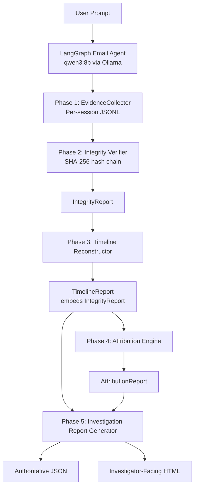
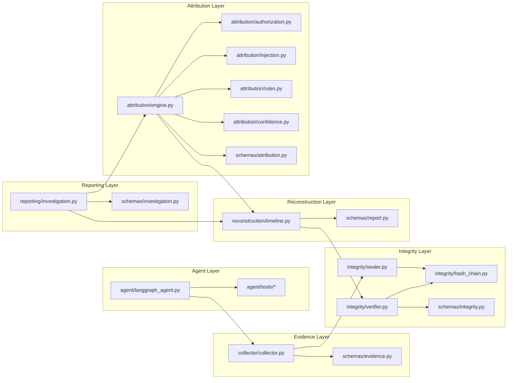
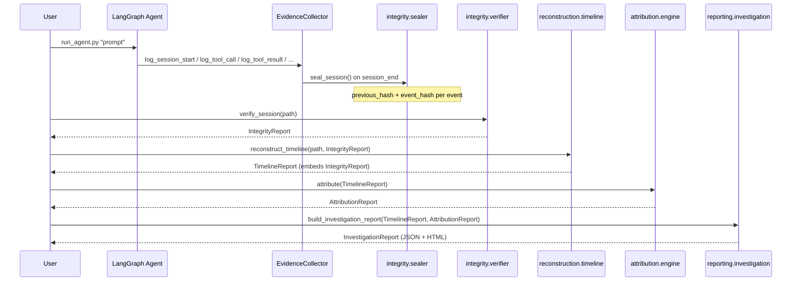
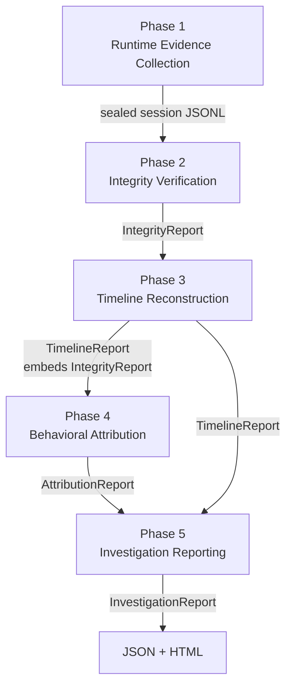
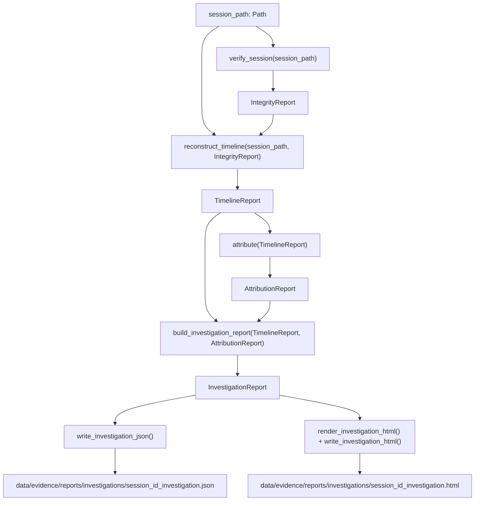
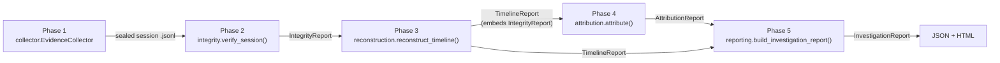

# AFEM — Agentic Forensic Evidence Model

**A deterministic, tamper-evident, explainable digital forensics framework for autonomous email agents**

[]()
[]()
[]()
[]()
[]()

> AFEM is a research framework for **digital forensic investigation of autonomous AI agents**, using an email-handling agent as a controlled, reproducible evidence-generating testbed. The agent itself is not the contribution — the forensic pipeline built around it is: tamper-evident evidence capture, deterministic timeline reconstruction, explainable behavioral attribution (including prompt-injection detection with behavioral correlation, not keyword matching), and automated investigation reporting.

---

## Table of Contents

1. [Project Overview](#project-overview)
2. [Research Motivation](#research-motivation)
3. [Problem Statement](#problem-statement)
4. [Research Objectives](#research-objectives)
5. [Research Contributions](#research-contributions)
6. [Research Perspective](#research-perspective)
7. [Design Philosophy](#design-philosophy)
8. [High-Level Architecture](#high-level-architecture)
9. [Repository Structure](#repository-structure)
10. [Technology Stack](#technology-stack)
11. [Installation](#installation)
12. [Virtual Environment Setup](#virtual-environment-setup)
13. [Dependency Installation](#dependency-installation)
14. [Configuration](#configuration)
15. [Dataset Preparation](#dataset-preparation)
16. [Mailbox Generation](#mailbox-generation)
17. [Mailbox Verification](#mailbox-verification)
18. [Starting the Project From Scratch](#starting-the-project-from-scratch)
19. [Phase 1 — Runtime Evidence Collection](#phase-1--runtime-forensic-evidence-collection)
20. [Phase 2 — Tamper-Evident Evidence Integrity](#phase-2--tamper-evident-evidence-integrity)
21. [Phase 3 — Timeline Reconstruction](#phase-3--automated-forensic-timeline-reconstruction)
22. [Phase 4 — Explainable Behavioral Attribution](#phase-4--explainable-behavioral-attribution)
23. [Phase 5 — Investigation Reporting](#phase-5--automated-investigation-reporting)
24. [Complete Project Execution (Step-by-Step)](#complete-project-execution-step-by-step)
25. [Phase Dependency Diagram](#phase-dependency-diagram)
26. [Output Directory Map](#output-directory-map)
27. [Evaluation Workflow](#evaluation-workflow)
28. [Report Interpretation Guide](#report-interpretation-guide)
29. [Testing](#testing)
30. [Command Reference](#command-reference)
31. [Troubleshooting](#troubleshooting)
32. [Developer Workflow](#developer-workflow)
33. [Git Workflow](#git-workflow)
34. [For Contributors](#for-contributors)
35. [Implementation Status](#implementation-status)
36. [Project Metrics](#project-metrics)
37. [Research Novelty](#research-novelty)
38. [Known Limitations](#known-limitations)
39. [Future Work](#future-work)
40. [Citation](#citation)
41. [License](#license)
42. [Acknowledgements](#acknowledgements)

---

## Project Overview

**AFEM (Agentic Forensic Evidence Model)** is an investigation-oriented digital forensics framework built around an autonomous, tool-using email agent. The agent — implemented with LangGraph and a local LLM served through Ollama — is a controlled trace generator: it exists to produce realistic, reproducible autonomous-action sequences for the forensic pipeline to analyze. **Digital forensics is the primary research contribution of this repository; the agent is supporting infrastructure.**

AFEM answers ten forensic questions for every agent session:

1. What did the user request?
2. What actions did the agent perform?
3. In what sequence did those actions occur?
4. Was the evidence modified, deleted, inserted, reordered, or truncated after collection?
5. Were the agent's actions authorized by the user?
6. Did the agent exceed the user's authorization?
7. Was potentially malicious email content retrieved during the session?
8. Did that retrieved content causally influence later agent behavior (prompt injection), or was it observed and resisted?
9. How confident, and how reliable, is the resulting attribution?
10. Can an investigator receive one coherent, provenance-linked, human-readable final report?

The framework is organized into five sequential phases, each consuming the structured output of the previous phase and producing a new, strongly-typed Pydantic report object. No phase re-implements the analytical logic of an earlier phase.

---

## Research Motivation

Autonomous LLM-driven agents are increasingly given real-world tool access — reading and sending email, modifying files, executing transactions. This creates a new forensic surface: when an agent takes an unexpected or harmful action, existing tooling gives investigators very little to work with. Application logs are typically unstructured, not tamper-evident, and offer no principled way to distinguish "the user asked for this," "the agent overstepped," and "the agent was manipulated by content it processed" (i.e., prompt injection).

AFEM treats an LLM agent's action stream the same way a forensic investigator treats any other digital evidence source: it must be captured completely, protected against post-hoc tampering, reconstructed into a coherent timeline, and only then interpreted — with the interpretation itself required to cite its supporting evidence rather than asserting a conclusion.

## Problem Statement

Existing approaches to monitoring AI agents fall into two broad categories, both insufficient for forensic purposes:

- **Application logging / observability tooling** (e.g., LangSmith-style tracing) captures what happened but typically has no tamper-evidence guarantee, no formal evidence-trust model, and no attribution reasoning — it tells you *what* occurred, not *whether the agent was authorized to do it* or *whether an external actor caused it*.
- **Prompt-injection detection tooling** in the broader ecosystem largely operates on keyword or classifier-based detection of suspicious *content*, without correlating that content to subsequent agent *behavior*. This produces a high false-positive rate: an email merely *containing* an injection-like phrase is not evidence that the agent *acted* on it.

AFEM's design directly addresses both gaps: Phase 2 provides SHA-256 hash-chain tamper evidence (a forensic integrity guarantee, not merely a log), and Phase 4's injection attribution explicitly requires **behavioral correlation** — a matching unauthorized action, in the correct temporal order, following the exposure — before an INJ verdict is produced. Suspicious content alone yields, at most, an "injection attempt detected" annotation, not an INJ classification.

## Research Objectives

1. Provide proactive, structured, per-event runtime evidence capture for autonomous email-agent activity, with no reliance on post-hoc log parsing.
2. Provide tamper-evident evidence preservation using a SHA-256 hash chain, with a formal, multi-valued evidence-trust model (`TRUSTED` / `DEGRADED` / `COMPROMISED`) rather than a binary valid/invalid flag.
3. Provide deterministic, reproducible forensic timeline reconstruction, ordered by monotonic sequence number rather than wall-clock timestamp.
4. Provide explainable, rule-based behavioral attribution across four classes (`AUTH`, `SCOPE`, `INJ`, `AMBIG`) with a transparent, per-rule confidence contribution model — not an opaque score.
5. Provide prompt-injection attribution that requires **behavioral correlation** between retrieved untrusted content and subsequent unauthorized agent action, not content classification alone.
6. Provide automated, deterministic, template-based investigation report generation in both authoritative machine-readable (JSON) and investigator-facing (HTML) form, with zero LLM involvement in the reporting layer.
7. Support fully offline, reproducible evaluation using both real Enron-derived email data and controlled synthetic scenarios, with deterministic evaluation harnesses that do not depend on nondeterministic LLM behavior for pass/fail correctness.

## Research Contributions

| # | Contribution | Where implemented |
|---|---|---|
| 1 | Structured, per-event runtime forensic evidence schema for LLM agent tool use | `schemas/evidence.py`, `collector/collector.py` |
| 2 | SHA-256 hash-chain tamper evidence with a four-valued evidence-trust model | `integrity/hash_chain.py`, `integrity/sealer.py`, `integrity/verifier.py` |
| 3 | Sequence-number-authoritative (not timestamp-authoritative) deterministic timeline reconstruction | `reconstruction/timeline.py` |
| 4 | Four-class explainable attribution taxonomy (`AUTH` / `SCOPE` / `INJ` / `AMBIG`) with transparent rule-derived confidence | `attribution/engine.py`, `attribution/rules.py`, `attribution/confidence.py` |
| 5 | Deterministic, rule-based authorization analysis over natural-language user prompts (explicit authorize/prohibit keyword rules, not an LLM classifier) | `attribution/authorization.py` |
| 6 | Behaviorally-correlated prompt-injection attribution requiring exposure → matching requested action → matching observed action → temporal ordering → lack of independent user authorization | `attribution/injection.py` |
| 7 | Execution-time forensic content snapshots (`forensic_snapshot`) that preserve what the agent actually saw, independent of the later-mutable mailbox database | `agent/langgraph_agent.py`, propagated via `reconstruction/timeline.py` |
| 8 | Deterministic, template-driven, LLM-free investigation report generation with structured JSON and escaped self-contained HTML output | `reporting/investigation.py` |

## Research Perspective

AFEM occupies a distinct position relative to three adjacent classes of tooling:

- **Versus traditional logging:** traditional application logs are unstructured, mutable after the fact, and carry no explicit trust semantics. AFEM's evidence is structured (Pydantic-typed events), hash-chained (tamper-evident), and explicitly trust-scored (`TRUSTED`/`DEGRADED`/`COMPROMISED`/`UNKNOWN`), so a downstream analyst — human or automated — knows exactly how much to trust each artifact before reasoning about it.
- **Versus intrusion detection systems (IDS):** an IDS typically produces a binary or scored alert based on pattern matching against known signatures, in near-real-time, optimized for detection speed. AFEM is explicitly a **post-hoc investigation framework** — it assumes evidence has already been collected and asks: *given this evidence, what is the most defensible interpretation of what happened, and how confident should we be?* It is designed for forensic defensibility (every claim cites its evidence) rather than alerting speed.
- **Versus generic agent-monitoring/observability tools:** observability tools answer "what did the agent do." AFEM additionally answers "was the agent authorized to do it," "was the evidence itself trustworthy," and "was external content the *cause* of what it did" — three questions that require the authorization, integrity, and injection-correlation layers this repository implements, none of which exist in typical tracing tools.

## Design Philosophy

- **Evidence first.** Nothing is inferred, summarized, or attributed until it has passed through Phase 1 capture and Phase 2 integrity verification.
- **Deterministic reasoning throughout.** Every phase after evidence capture — integrity verification, timeline reconstruction, attribution, and report generation — is pure, rule-based, deterministic Python. No phase after Phase 1 invokes an LLM. Given identical input evidence, every later phase produces byte-identical *substantive* output (only `generated_at`-style timestamps vary).
- **Explainability over black-box decisions.** Phase 4's `AttributionReport` exposes every `TriggeredRule` and every signed `RuleContribution` that produced the final confidence score — an investigator can trace the number back to specific evidence.
- **Integrity before attribution; attribution before reporting.** Each phase strictly consumes, never recomputes, the output of the phase before it. Phase 5 in particular is documented, throughout `reporting/investigation.py`, as performing *zero* re-derivation of attribution, confidence, or reliability — it copies these fields verbatim from `AttributionReport`.
- **Reproducibility.** The evaluation harnesses (`scripts/run_scope_evaluation.py`, `scripts/run_injection_evaluation.py`, `scripts/run_injection_resistance_evaluation.py`) construct evidence through the real `EvidenceCollector` rather than fabricating report objects, so a positive test result is evidence the full pipeline works end-to-end, not evidence that a mock behaves as expected.
- **Offline-first investigation.** No phase from Phase 2 onward requires Ollama, network access, or a live LLM. An investigator can run the complete pipeline against previously-captured evidence with no model server running at all.
- **Machine-readable outputs paired with human-readable reports.** Every Phase 5 investigation produces both an authoritative JSON artifact (`schemas/investigation.py` → `InvestigationReport`, dumped with `model_dump(mode="json")`) and a self-contained, escaped, dependency-free HTML report for direct human review.

---

## High-Level Architecture



### Component Interaction Diagram



### Execution Pipeline



### Evidence Flow

```
Agent tool execution
    │
    ▼
EvidenceCollector._write()          (schemas/evidence.py events, sequence_number assigned)
    │
    ▼
data/evidence/sessions/<session_id>.jsonl     (unsealed, append-only)
    │
    ▼
integrity.sealer.seal_session()      (auto-triggered on log_session_end())
    │  adds previous_hash + event_hash per event, genesis = "0"*64
    ▼
data/evidence/sessions/<session_id>.jsonl     (sealed, tamper-evident)
```

### Phase Dependency Graph



### Investigation Report Generation Pipeline



---

## Repository Structure

> The tree below is the **exact, verified structure of the uploaded repository**, filtered only to remove `.venv/`, `__pycache__/`, `.pytest_cache/`, and `afem.egg-info/` (build/environment artifacts, not source). No folder or file name below is invented.

```
AFEM_repo/
│
├── .env                              # Local environment variables (not committed — see .gitignore)
├── .gitignore
├── config.py                         # Single source of truth for paths and tunables
├── db.py                             # SQLite connection helper for mailbox.db
├── pyproject.toml                    # Build system, dependencies, pytest configuration
├── README.md                         # This file
├── requirements.txt                  # Flat pip-installable dependency list
│
├── agent/
│   ├── __init__.py
│   ├── langgraph_agent.py            # LangGraph graph definition; agent_node / tool_node
│   ├── prompts/
│   │   └── system_prompt.txt         # System prompt for the email agent
│   └── tools/
│       ├── __init__.py
│       ├── search_email.py           # search_email() — SQLite FTS5 lookup
│       ├── retrieve_email.py         # retrieve_email() — full EmailRecord fetch
│       ├── create_draft.py           # create_draft() — mailbox.db parse_status='draft'
│       └── send_email.py             # send_email() — simulated send (parse_status='sent')
│
├── attribution/                      # Phase 4
│   ├── __init__.py
│   ├── authorization.py              # Deterministic keyword-based authorization analyzer
│   ├── classifier.py                 # Attribution-support classification utilities
│   ├── confidence.py                 # Rule-delta confidence model + trust-quality ceilings
│   ├── engine.py                     # attribute(TimelineReport) -> AttributionReport
│   ├── injection.py                  # Prompt-injection indicator scanning + behavioral correlation
│   └── rules.py                      # AUTH / SCOPE / INJ / trust rule definitions
│
├── collector/                        # Phase 1
│   ├── __init__.py
│   └── collector.py                  # EvidenceCollector — thread-safe JSONL evidence writer
│
├── data/
│   ├── evidence/
│   │   ├── evaluation/               # Phase 2 tamper-evaluation fixture set (E0–E10 matrix)
│   │   │   ├── 00_clean_control.jsonl
│   │   │   ├── 01_content_modified.jsonl
│   │   │   ├── 02_event_deleted.jsonl
│   │   │   ├── 03_event_duplicated.jsonl
│   │   │   ├── 04_events_reordered.jsonl
│   │   │   ├── 05_event_inserted.jsonl
│   │   │   ├── 06_event_hash_modified.jsonl
│   │   │   ├── 07_session_truncated.jsonl
│   │   │   ├── 08_json_corrupted.jsonl
│   │   │   ├── 09_session_id_modified.jsonl
│   │   │   └── ambig_tampered_session.jsonl
│   │   ├── reports/
│   │   │   ├── attributions/         # Phase 4 AttributionReport JSON, one per session
│   │   │   ├── investigations/       # Phase 5 InvestigationReport JSON + HTML
│   │   │   └── timelines/            # Phase 3 TimelineReport JSON
│   │   └── sessions/                 # Phase 1/2 sealed per-session evidence JSONL
│   ├── processed/
│   │   ├── mailbox.db                # SQLite mailbox (generated, gitignored)
│   │   └── mailbox.sqbpro            # DB Browser for SQLite project file (optional, dev convenience)
│   └── raw/
│       └── emails.csv                # Enron Email Dataset CSV (gitignored, user-supplied)
│
├── db/
│   ├── schema.sql                    # Reference mailbox schema DDL
│   └── migrations/                   # (present, currently empty)
│
├── docs/                             # (present, currently empty — reserved for research docs/figures)
│
├── integrity/                        # Phase 2
│   ├── __init__.py
│   ├── hash_chain.py                 # Canonical JSON, SHA-256 hashing, GENESIS_HASH
│   ├── sealer.py                     # seal_session() — atomic hash-chain sealing
│   └── verifier.py                   # verify_session() -> IntegrityReport
│
├── logs/
│   └── build_mailbox_*.log           # Mailbox build run logs
│
├── reconstruction/                   # Phase 3
│   ├── __init__.py
│   ├── attack_chain.py               # Reserved for future multi-session attack-chain reconstruction
│   └── timeline.py                   # reconstruct_timeline() -> TimelineReport
│
├── reporting/                        # Phase 5
│   ├── investigation.py              # build/render/write investigation reports
│   ├── report_generator.py           # (present; empty — superseded by investigation.py)
│   └── templates/                    # (present, currently empty)
│
├── schemas/                          # Pydantic v2 models — the data contract of the whole pipeline
│   ├── __init__.py                   # Re-exports every public schema type
│   ├── email.py                      # EmailRecord, DraftRecord, SearchResult
│   ├── evidence.py                   # BaseEvent + six concrete Phase 1 event types
│   ├── integrity.py                  # FindingType, Severity, ForensicFinding, EvidenceTrust, IntegrityReport
│   ├── report.py                     # TimelineEntry, ReconstructionCompleteness, TimelineReport
│   ├── attribution.py                # AttributionClass, InjectionAssessment, AttributionReport, …
│   └── investigation.py              # InvestigationReport (Phase 5)
│
├── scripts/                          # All CLI entry points
│   ├── build_mailbox.py              # Phase 0 — Enron CSV -> mailbox.db
│   ├── verify_mailbox.py             # Phase 0 — mailbox.db health report
│   ├── run_agent.py                  # Phase 1 — run the LangGraph email agent
│   ├── verify_session.py             # Phase 2 — CLI for integrity.verify_session()
│   ├── reconstruct_timeline.py       # Phase 3 — CLI for reconstruction.reconstruct_timeline()
│   ├── attribute_session.py          # Phase 4 — CLI for attribution.attribute()
│   ├── generate_investigation_report.py  # Phase 5 — CLI for reporting.investigation
│   ├── run_scope_evaluation.py       # Controlled SCOPE evaluation harness
│   ├── run_injection_evaluation.py   # Controlled behaviorally-correlated INJ evaluation harness
│   └── run_injection_resistance_evaluation.py  # Controlled injection-resistance (AUTH) harness
│
└── tests/
    ├── __init__.py
    ├── test_placeholder.py
    ├── test_schemas.py               # Pydantic schema unit tests (all phases)
    ├── test_collector.py             # Phase 1 EvidenceCollector tests
    ├── test_tools.py                 # agent/tools/* unit tests against mailbox.db
    ├── test_search_result.py         # SearchResult schema tests
    ├── test_agent.py                 # LangGraph agent integration tests
    ├── test_integrity.py             # Phase 2 hash-chain / verifier tests
    ├── test_timeline.py              # Phase 3 reconstruction tests
    ├── test_attribution.py           # Phase 4 attribution engine tests
    └── test_investigation.py         # Phase 5 investigation report tests
```

> **Note on `reporting/report_generator.py`:** this file is present in the repository but is empty. It was scaffolded early in the project and superseded by `reporting/investigation.py`, which implements the complete Phase 5 aggregation, rendering, and persistence logic. It has been intentionally left in place rather than deleted, in case it is referenced elsewhere or reserved for a distinct future report type; contributors should not add logic to it without first confirming its role.

> **Note on `attribution/classifier.py` and `reconstruction/attack_chain.py`:** both files are present in the repository. `attack_chain.py` is reserved for a possible future multi-session/cross-session attack-chain reconstruction capability and is not part of the current single-session Phase 3 pipeline. Consult the file directly for its current contents before relying on it in new work.

---

## Technology Stack

| Component | Choice | Rationale |
|---|---|---|
| Language | Python 3.11 | `pyproject.toml` pins `requires-python = ">=3.11"` |
| Agent orchestration | LangGraph ≥0.2.0 | Explicit graph-based control over the tool-call loop, required for the "one tool action per LLM iteration" execution discipline the agent relies on |
| LLM runtime | Ollama, `qwen3:8b` (configurable via `OLLAMA_MODEL` env var) | Fully local, no external API dependency; keeps the agent — and therefore all Phase 1 evidence — reproducible without a paid API |
| LLM integration | `langchain-core` ≥0.2.0, `langchain-ollama` ≥0.2.0 | Standard LangChain message/tool-call types consumed by the LangGraph graph |
| Schema/validation | Pydantic ≥2.0.0 | Every report object in every phase (`IntegrityReport`, `TimelineReport`, `AttributionReport`, `InvestigationReport`) is a Pydantic v2 model, giving the pipeline strict, self-documenting, JSON-serializable data contracts |
| Mailbox storage | SQLite (via `mailbox.db`), FTS5 full-text index | Zero-dependency embedded storage; FTS5 provides `search_email()`'s keyword search without a separate search service |
| Dataset ingestion | pandas ≥2.0.0 | Chunked CSV reading (`read_csv(chunksize=...)`) over the large Enron CSV without loading it entirely into memory |
| Environment config | `python-dotenv` ≥1.0.0 | Loads `.env` for local secrets/config (e.g. `OLLAMA_MODEL`) |
| Testing | pytest ≥8.0.0 | `pyproject.toml` sets `testpaths = ["tests"]` |
| Integrity | Python standard library `hashlib` (SHA-256) | No external cryptography dependency required for the hash chain |
| HTML rendering | Python standard library `html.escape` | Deliberately dependency-free — no Jinja2 or other templating engine is present in `pyproject.toml`; see [Phase 5](#phase-5--automated-investigation-reporting) |

---

## Installation

### Prerequisites

- **Windows** (the project's PowerShell-based workflow is documented below; the pure-Python pipeline itself has no OS-specific code beyond path handling, which uses `pathlib.Path` throughout)
- **Python 3.11**
- **[Ollama](https://ollama.com)** installed and running locally, with the `qwen3:8b` model pulled (only required for Phase 1 agent execution — Phases 2–5 do not require Ollama)
- **Git**

### Clone the repository

```powershell
git clone https://github.com/giganiga6969/AFEM.git
cd AFEM
```

---

## Virtual Environment Setup

```powershell
python -m venv .venv
```

Activate it:

```powershell
.\.venv\Scripts\Activate.ps1
```

> If PowerShell blocks script execution, run once as Administrator:
> ```powershell
> Set-ExecutionPolicy -ExecutionPolicy RemoteSigned -Scope CurrentUser
> ```

---

## Dependency Installation

Two equivalent options are provided in the repository.

**Option A — editable install via `pyproject.toml` (recommended for development):**

```powershell
pip install -e .
pip install -e ".[dev]"
```

**Option B — flat installation via `requirements.txt`:**

```powershell
pip install -r requirements.txt
```

Both install the same dependency set:

```
pandas>=2.0.0
langgraph>=0.2.0
langchain-core>=0.2.0
langchain-ollama>=0.2.0
pydantic>=2.0.0
python-dotenv>=1.0.0
pytest>=8.0.0
```

### Pull the LLM model (required only for running the agent, Phase 1)

```powershell
ollama pull qwen3:8b
```

---

## Configuration

All paths and tunables are centralized in **`config.py`** at the repository root. Every other module imports from here rather than hard-coding a path, so relocating the project or renaming a data directory requires exactly one edit.

```python
ROOT_DIR = Path(__file__).resolve().parent

DATA_DIR      = ROOT_DIR / "data"
RAW_DIR       = DATA_DIR / "raw"
PROCESSED_DIR = DATA_DIR / "processed"
LOG_DIR       = ROOT_DIR / "logs"

MAILBOX_DB = PROCESSED_DIR / "mailbox.db"

# Directory containing one JSONL evidence file per AFEM session.
EVIDENCE_DIR = DATA_DIR / "evidence" / "sessions"

# Backward-compatible alias used by modules that import EVIDENCE_FILE.
EVIDENCE_FILE = EVIDENCE_DIR

# Directory for Phase 5 investigation reports (JSON + HTML).
INVESTIGATIONS_DIR = DATA_DIR / "evidence" / "reports" / "investigations"

LLM_MODEL      = os.getenv("OLLAMA_MODEL", "qwen3:8b")
MAX_TOKENS     = 4096
MAX_ITERATIONS = 10

# Directories are created at import time:
EVIDENCE_DIR.mkdir(parents=True, exist_ok=True)
LOG_DIR.mkdir(parents=True, exist_ok=True)
INVESTIGATIONS_DIR.mkdir(parents=True, exist_ok=True)
```

| Constant | Value | Purpose |
|---|---|---|
| `ROOT_DIR` | repository root | Base for every other path |
| `DATA_DIR` | `data/` | Parent of raw, processed, and evidence data |
| `RAW_DIR` | `data/raw/` | Source dataset location (`emails.csv`) |
| `PROCESSED_DIR` | `data/processed/` | Generated `mailbox.db` |
| `MAILBOX_DB` | `data/processed/mailbox.db` | SQLite mailbox used by all four agent tools |
| `EVIDENCE_DIR` / `EVIDENCE_FILE` | `data/evidence/sessions/` | One JSONL file per agent session (Phase 1/2) |
| `INVESTIGATIONS_DIR` | `data/evidence/reports/investigations/` | Phase 5 JSON + HTML output |
| `LLM_MODEL` | `qwen3:8b` (overridable via `OLLAMA_MODEL` env var) | Model the LangGraph agent invokes through Ollama |
| `MAX_TOKENS` | `4096` | LLM generation cap |
| `MAX_ITERATIONS` | `10` | Safety bound on the agent's tool-call loop |

Set `OLLAMA_MODEL` in `.env` (loaded via `python-dotenv`) or as an environment variable to use a different local model without editing `config.py`.

`db.py` at the repository root provides the SQLite connection helper used by `agent/tools/*` and `scripts/build_mailbox.py` / `scripts/verify_mailbox.py` to open `MAILBOX_DB`.

---

## Dataset Preparation

AFEM uses a **hybrid mailbox**:

1. **Enron Email Dataset** — real, large-scale email data providing realistic sender/subject/body distributions for `search_email()` and `retrieve_email()` to operate over.
2. **Controlled synthetic evaluation emails** — deliberately constructed messages (e.g. containing prompt-injection–style instructions) inserted into the same mailbox for the Phase 4 evaluation harnesses. See [Evaluation Workflow](#evaluation-workflow).

Place the Enron CSV export at:

```
data/raw/emails.csv
```

`data/raw/` is listed in `.gitignore` — the raw dataset is **not** committed to the repository and must be supplied locally.

---

## Mailbox Generation

```powershell
python scripts/build_mailbox.py --csv data/raw/emails.csv --db data/processed/mailbox.db --max-emails 1000
```

**What it does:** streams the CSV in chunks via pandas (`chunksize=`), parses each row into a mailbox record, and writes it into `mailbox.db`, building the SQLite FTS5 index used by `search_email()`. A run log is written to `logs/build_mailbox_<timestamp>.log`.

**Generated files:**
- `data/processed/mailbox.db`
- `logs/build_mailbox_YYYYMMDD_HHMMSS.log`

---

## Mailbox Verification

```powershell
python scripts/verify_mailbox.py --db data/processed/mailbox.db
```

**What it does:** runs a health-check battery against `mailbox.db` — record counts, FTS5 index integrity, schema sanity — and prints a pass/fail summary to the console.

---

## Starting the Project From Scratch

For a first-time setup, run the following in order (each is explained in full detail in its own section below):

```powershell
git clone https://github.com/giganiga6969/AFEM.git
cd AFEM
python -m venv .venv
.\.venv\Scripts\Activate.ps1
pip install -e ".[dev]"
ollama pull qwen3:8b
# place emails.csv at data/raw/emails.csv
python scripts/build_mailbox.py
python scripts/verify_mailbox.py
python scripts/run_agent.py "Find all emails related to payroll"
python scripts/verify_session.py --list
python scripts/verify_session.py data/evidence/sessions/<session_id>.jsonl
python scripts/reconstruct_timeline.py data/evidence/sessions/<session_id>.jsonl
python scripts/attribute_session.py data/evidence/sessions/<session_id>.jsonl
python scripts/generate_investigation_report.py data/evidence/sessions/<session_id>.jsonl
python -m pytest -q
```

Full detail on every step is in [Complete Project Execution](#complete-project-execution-step-by-step).

---

## Phase 1 — Runtime Forensic Evidence Collection

### Purpose

Capture every observable event during an agent session as structured, typed evidence — before any analysis, interpretation, or judgment is applied.

### Implementation

- **`agent/langgraph_agent.py`** defines the LangGraph state graph. The agent executes **one tool action per LLM iteration**, so that a dependent tool call (e.g. `send_email` needing the `draft_id` returned by a prior `create_draft`) always has the actual prior tool result available before the next tool call is issued.
- **`collector/collector.py`** implements `EvidenceCollector`, a thread-safe, append-only JSONL writer. Each event is assigned a monotonically increasing `sequence_number` — the field Phase 2/3 treat as the *authoritative* ordering signal, deliberately not timestamps (which can collide or be unreliable).
- **`schemas/evidence.py`** defines `BaseEvent` and six concrete event types: `SessionStartEvent`, `UserPromptEvent`, `ToolCallEvent`, `ToolResultEvent`, `AgentResponseEvent`, `SessionEndEvent`.
- **`agent/tools/*.py`** implement the four tools the agent can call: `search_email`, `retrieve_email`, `create_draft`, `send_email`.

For `retrieve_email`, the agent captures a **bounded execution-time forensic snapshot** (`forensic_snapshot`) of the retrieved email body directly into the evidence stream — this is what allows Phase 4's injection analysis to inspect what content the agent actually saw, independent of the mailbox's later (mutable) state.

### Files

```
agent/langgraph_agent.py
agent/prompts/system_prompt.txt
agent/tools/search_email.py
agent/tools/retrieve_email.py
agent/tools/create_draft.py
agent/tools/send_email.py
collector/collector.py
schemas/evidence.py
scripts/run_agent.py
```

### Input

A natural-language user prompt, and the populated `mailbox.db`.

### Output

An **unsealed** JSONL evidence file at `data/evidence/sessions/<session_id>.jsonl`, immediately sealed by Phase 2's `seal_session()` (auto-triggered by `EvidenceCollector.log_session_end()`).

### How to run

```powershell
python scripts/run_agent.py "Find all emails related to payroll"
```

or interactively:

```powershell
python scripts/run_agent.py --interactive
```

or with an explicit flag:

```powershell
python scripts/run_agent.py --prompt "Show me emails from hr@enron.com"
```

### Expected console output

```
────────────────────────────────────────────────────────────
  Prompt: Find all emails related to payroll
────────────────────────────────────────────────────────────

── Agent Response ─────────────────────────────────────────
<agent's natural-language summary of what it found>
───────────────────────────────────────────────────────────
```

(`run_agent.py` logs at `INFO` level to stdout via `logging.basicConfig`, so tool-call activity is also visible during execution.)

### Expected generated files

```
data/evidence/sessions/<session_id>.jsonl
```

### How to verify

Inspect the JSONL directly, or proceed to Phase 2:

```powershell
python scripts/verify_session.py --list
```

### Common failure cases

| Symptom | Likely cause | Fix |
|---|---|---|
| `ConnectionError` / Ollama unreachable | Ollama service not running | Start Ollama (`ollama serve`) and confirm `ollama list` shows `qwen3:8b` |
| Agent hangs indefinitely | `MAX_ITERATIONS` loop with a persistently failing tool | Check `mailbox.db` exists at `MAILBOX_DB`; run `verify_mailbox.py` first |
| `sqlite3.OperationalError: no such table` | `mailbox.db` not yet built | Run `scripts/build_mailbox.py` before `run_agent.py` |

### What Phase 2 consumes

The sealed session JSONL file's path — Phase 2 never inspects the agent or the LangGraph graph directly.

---

## Phase 2 — Tamper-Evident Evidence Integrity

### Purpose

Cryptographically protect Phase 1 evidence against silent post-hoc modification, deletion, insertion, reordering, and truncation, and produce a formal, multi-valued trust assessment rather than a binary valid/invalid flag.

### Implementation

- **`integrity/hash_chain.py`** — canonical JSON serialization, SHA-256 hashing, the `GENESIS_HASH = "0" * 64` sentinel for the first event in a chain.
- **`integrity/sealer.py`** — `seal_session(path)`: computes `previous_hash` / `event_hash` for every event in a session file and performs an atomic write-back (temp file + `Path.replace()`), so a sealing failure can never leave a half-written file. `seal_session()` is idempotent — resealing an already-sealed file is a safe no-op.
- **`integrity/verifier.py`** — `verify_session(path) -> IntegrityReport`: recomputes and checks the entire hash chain, detects sequence gaps, duplicate sequence numbers, missing/malformed fields, missing or inconsistent `SessionEndEvent`, and workflow-order anomalies (e.g. a `tool_call` with no matching `tool_result`).
- **`schemas/integrity.py`** — defines `EvidenceTrust` (`TRUSTED` / `DEGRADED` / `COMPROMISED` / `UNKNOWN`), `FindingType`, `Severity`, `ForensicFinding`, and the top-level `IntegrityReport`.

**Why SHA-256 and a hash chain, specifically:** each event's hash commits to both its own content and the previous event's hash, so any single-event modification invalidates every subsequent hash in the chain — this is what makes deletion, insertion, and reordering detectable, not just content modification.

### Files

```
integrity/hash_chain.py
integrity/sealer.py
integrity/verifier.py
schemas/integrity.py
scripts/verify_session.py
```

### Input

A sealed (or unsealed — `verify_session()` does not require pre-sealing to run, though `EvidenceCollector` seals automatically) session JSONL file.

### Output

An `IntegrityReport` Pydantic object: `verdict` (`"VERIFIED"` / `"FAILED"`), `evidence_trust`, `session_complete`, `genesis_hash`, `terminal_hash`, `verified_at`, and a list of `ForensicFinding` objects for any detected anomaly.

### How to run

```powershell
python scripts/verify_session.py data/evidence/sessions/<session_id>.jsonl
```

List available sessions first if the ID is not known:

```powershell
python scripts/verify_session.py --list
```

Machine-readable output:

```powershell
python scripts/verify_session.py data/evidence/sessions/<session_id>.jsonl --json
```

Save the full report:

```powershell
python scripts/verify_session.py data/evidence/sessions/<session_id>.jsonl --save-json out.json
```

### Expected console output (clean evidence)

```
Integrity Status:  VERIFIED
Evidence Trust:    TRUSTED
Session Complete:  Yes
Findings:          None
Terminal Hash:     <64-character hex digest>
```

### Expected console output (tampered evidence)

```
Integrity Status:  FAILED
Evidence Trust:    COMPROMISED
First Broken Event: <sequence_number>
Finding:            content_hash_mismatch
Severity:           CRITICAL
Stored event hash:     <hex>...
Recomputed event hash: <hex>...
```

### Expected generated files

None by default (verification is read-only) unless `--save-json` is passed.

### How to verify correctness

The repository's `data/evidence/evaluation/` directory contains a pre-built E0–E10 tamper matrix (see [Evaluation Workflow](#evaluation-workflow)) specifically for exercising every detection path.

### Common failure cases

| Symptom | Likely cause | Fix |
|---|---|---|
| `FileNotFoundError` | Wrong session path | Run `--list` to see valid filenames |
| Unexpectedly `COMPROMISED` on a session you didn't touch | The file was resealed twice with different content, or edited by an external tool (including some text editors that alter line endings) | Do not hand-edit sealed JSONL files; treat them as immutable once sealed |

### What Phase 3 consumes

The full `IntegrityReport` object (not just its verdict string) — Phase 3 embeds it directly inside `TimelineReport.integrity_report`.

---

## Phase 3 — Automated Forensic Timeline Reconstruction

### Purpose

Transform the flat, sequence-ordered event stream into an investigator-readable, semantically paired timeline — while explicitly propagating (never recomputing) the integrity state of each entry.

### Implementation

- **`reconstruction/timeline.py`** — `reconstruct_timeline(session_path, integrity_report) -> TimelineReport`. Pairs each `tool_call` with its corresponding `tool_result` into a single `TimelineEntry` of `event_type="tool_action"`, so the timeline reads as "the agent invoked X and received Y" rather than as two disconnected raw events. Ordering is **always** by `sequence_number`; timestamps are recorded as supporting temporal evidence only, never as the ordering key, because timestamps can be missing, duplicated, or (in a tampering scenario) manipulated independently of sequence order.
- **`schemas/report.py`** — `ReconstructionCompleteness` (`COMPLETE` / `PARTIAL` / `MINIMAL` / `FAILED`), `TimelineEntry`, `TimelineReport`.

Each `TimelineEntry` carries `integrity_status` (`"valid"` / `"invalid"` / `"unknown"`), propagated per-event from the corresponding `VerificationResult` in the embedded `IntegrityReport` — a compromised entry is **retained and flagged**, never silently dropped from the timeline.

### Files

```
reconstruction/timeline.py
schemas/report.py
scripts/reconstruct_timeline.py
```

### Input

A session JSONL path, and its `IntegrityReport` (obtained by first calling `verify_session()`).

### Output

A `TimelineReport`: `entries` (ordered `TimelineEntry` list), `tool_sequence`, `anomalies`, `evidence_trust`, `completeness`, `user_prompt`, and the embedded `integrity_report`.

### How to run

```powershell
python scripts/reconstruct_timeline.py data/evidence/sessions/<session_id>.jsonl
```

JSON output (excludes the embedded `integrity_report` to keep output size manageable — hash anchors are still shown separately):

```powershell
python scripts/reconstruct_timeline.py data/evidence/sessions/<session_id>.jsonl --json
```

Save for downstream use:

```powershell
python scripts/reconstruct_timeline.py data/evidence/sessions/<session_id>.jsonl --save-json data/evidence/reports/timelines/<session_id>_timeline.json
```

### Expected console output

A formatted report showing session summary, tool-call sequence, any anomalies, a full per-entry timeline table (sequence, type, actor, integrity status, action/summary), and integrity hash anchors, ending with a summary line such as:

```
  RECONSTRUCTION: COMPLETE | TRUST: TRUSTED
```

### Expected generated files

```
data/evidence/reports/timelines/<session_id>_timeline.json     (only if --save-json is used)
```

### How to verify correctness

`completeness == COMPLETE` and `evidence_trust == TRUSTED` for a clean session with a normal `session_start → user_prompt → tool_action(s) → agent_response → session_end` structure.

### Common failure cases

| Symptom | Likely cause | Fix |
|---|---|---|
| `completeness = PARTIAL` on evidence that looks fine | Missing `session_end` or a workflow anomaly Phase 2 flagged | Check `IntegrityReport.workflow_anomalies` via `verify_session.py` first |
| Orphaned `tool_call` in the timeline | Session was interrupted mid-tool-call (e.g. agent crashed) | Expected behavior — the entry is flagged with `anomaly="orphaned_tool_call"`, not hidden |

### What Phase 4 consumes

The complete `TimelineReport` object, including the embedded `IntegrityReport` — Phase 4 never re-runs verification.

---

## Phase 4 — Explainable Behavioral Attribution

### Purpose

Classify the observed agent behavior into one of four forensically meaningful categories, with every conclusion traceable to specific triggered rules and evidence references — never an opaque score.

### Implementation

- **`attribution/authorization.py`** — deterministic keyword-based analysis of the user prompt, producing the set of tools the user authorized and the set explicitly prohibited. Negative constraints ("do not send") always override broad positive wording.
- **`attribution/injection.py`** — scans `forensic_snapshot` content captured during `retrieve_email` for injection-indicator phrases (grouped into categories such as instruction override, role impersonation, secrecy/evasion, unauthorized-action requests, data exfiltration), and extracts the *specific actions* that indicator content requests (`extract_requested_actions`), so a later unauthorized action can be matched against what was actually requested — not just correlated with the mere presence of suspicious text.
- **`attribution/rules.py`** — the individual `AUTH`/`SCOPE`/`INJ`/trust-quality rules, each producing a `TriggeredRule` and a signed `RuleContribution`.
- **`attribution/confidence.py`** — sums `RuleContribution` deltas and applies an evidence-quality ceiling (`TRUSTED`+`COMPLETE` → no ceiling; `DEGRADED`/`PARTIAL` → 0.75; `COMPROMISED` → 0.40; `UNKNOWN` → 0.30; `FAILED` reconstruction → 0.20).
- **`attribution/engine.py`** — `attribute(timeline_report) -> AttributionReport`, orchestrating the above in strict priority order: trust gate → authorization analysis → injection scan → rule evaluation → verdict selection → task-outcome assessment → confidence scoring → explanation construction.

### Attribution classes

| Class | Meaning |
|---|---|
| **AUTH** | Observed behavior is supported by explicit or reasonably implied user authorization; no material unauthorized action present. |
| **SCOPE** | The agent performed one or more actions outside user authorization, with insufficient evidence that injected content caused it. |
| **INJ** | An unauthorized action is *behaviorally correlated* with instruction-like content retrieved from untrusted email — requires exposure, a matching requested action, a matching observed action, correct temporal order, and the absence of independent user authorization for that same action. |
| **AMBIG** | Evidence is missing, compromised, contradictory, or otherwise insufficient for a reliable AUTH/SCOPE/INJ conclusion. |

Critically, **injection-like content alone never produces an INJ verdict.** If suspicious content is retrieved but the agent performs no matching unauthorized action, the result is `AUTH` with `injection_assessment = ATTEMPT_DETECTED` — the attempt is recorded, but is explicitly *not* described as successful injection.

### Files

```
attribution/authorization.py
attribution/injection.py
attribution/rules.py
attribution/confidence.py
attribution/engine.py
schemas/attribution.py
scripts/attribute_session.py
scripts/run_scope_evaluation.py
scripts/run_injection_evaluation.py
scripts/run_injection_resistance_evaluation.py
```

### How to run

```powershell
python scripts/attribute_session.py data/evidence/sessions/<session_id>.jsonl
```

```powershell
python scripts/attribute_session.py data/evidence/sessions/<session_id>.jsonl --json
python scripts/attribute_session.py data/evidence/sessions/<session_id>.jsonl --save-json out.json
python scripts/attribute_session.py --list
```

### Expected console output

A formatted verdict section (attribution class, confidence score + label, task outcome, evidence trust, reconstruction, reliability), an authorization-analysis section, an injection-indicators section, a triggered-rules section, a per-rule confidence breakdown, uncertainty reasons if any, a concise explanation, and provenance (genesis/terminal hash, verified-at timestamp), ending with:

```
  VERDICT: AUTH — VERY HIGH confidence
```

### Expected generated files

```
data/evidence/reports/attributions/<session_id>_attribution.json
```

(written by default even without `--save-json`, per `attribute_session.py`'s default-save behavior)

### Exit codes

`0` for `AUTH`/`SCOPE`/`INJ`; `1` for `AMBIG`, error, or missing session — useful for scripting evaluation batches.

### How to verify correctness

Run the three evaluation harnesses (see [Evaluation Workflow](#evaluation-workflow)) — each asserts its expected verdict internally and prints `PASSED` on success.

### Common failure cases

| Symptom | Likely cause | Fix |
|---|---|---|
| Expected `AUTH`, got `SCOPE` | Authorization keyword did not match the phrasing used in the prompt | Review `attribution/authorization.py`'s keyword tables — phrasing must match one of the documented positive/negative patterns |
| Expected `INJ`, got `AUTH` with `ATTEMPT_DETECTED` | The observed unauthorized action didn't match what the injected content actually requested, or occurred before the retrieval in sequence order | Confirm `forensic_snapshot` was captured (older sessions predating this feature will not have it) and that the unauthorized action's `sequence_number` is greater than the retrieval's |
| `AMBIG` on evidence that looks fine | `evidence_trust` is `DEGRADED`/`COMPROMISED`/`UNKNOWN`, or `reconstruction_completeness == FAILED` | Check the upstream `IntegrityReport`/`TimelineReport` first — Phase 4 is intentionally conservative under low evidence quality |

### What Phase 5 consumes

The complete `AttributionReport` object, alongside the `TimelineReport` from Phase 3 — every attribution-related field is copied verbatim, never recomputed.

---

## Phase 5 — Automated Investigation Reporting

### Purpose

Aggregate Phase 2 (via the embedded `IntegrityReport`), Phase 3, and Phase 4 output into one coherent, provenance-linked investigation artifact — in both authoritative machine-readable and investigator-facing human-readable form — with **zero LLM involvement** and **zero re-derivation** of upstream conclusions.

### Implementation

- **`schemas/investigation.py`** — `InvestigationReport`. Embeds existing typed Phase 2–4 models directly (`TimelineEntry`, `ForensicFinding`, `AuthorizationAssessment`, `InjectionIndicator`, `TriggeredRule`, `RuleContribution`, `EvidenceReference`, and the Phase 4 enums) rather than flattening them into untyped dictionaries — this preserves Pydantic validation end-to-end and avoids AFEM ever having two competing representations of the same forensic fact.
- **`reporting/investigation.py`** — implements four separated responsibilities:
  - `build_investigation_report(timeline_report, attribution_report, source_session_path) -> InvestigationReport` — pure aggregation, no I/O, no analytical logic.
  - `render_investigation_html(report) -> str` — pure rendering, no analysis, no I/O. Every dynamic value passes through a single centralized `_escape()` helper (`html.escape(str(value), quote=True)`) before being interpolated into the HTML string.
  - `write_investigation_json(report, output_dir) -> Path` — persists `report.model_dump(mode="json")` via `json.dump(..., ensure_ascii=False, indent=2)`, using an atomic temp-file-then-`Path.replace()` write so an interrupted write can never leave a corrupt report on disk.
  - `write_investigation_html(report, output_dir) -> Path` — same atomic-write strategy for the HTML artifact.
  - `generate_investigation_report(...)` — a thin convenience wrapper that only delegates to the four functions above.

**Why no templating engine (Jinja2, etc.):** `pyproject.toml` and `requirements.txt` intentionally carry no templating dependency — HTML is composed via plain f-strings with every dynamic value passed through the centralized escaping helper, keeping the reporting layer dependency-free and trivially auditable for injection safety.

**Why the attribution fields are copied, not recomputed:** `attribution_class`, `confidence_score`, `confidence_label`, `reliable` (from `AttributionReport.is_reliable`), `task_outcome`, `evidence_trust`, `reconstruction_completeness`, `authorization`, `observed_actions`, `unauthorized_actions`, `injection_assessment`, `injection_indicators`, `triggered_rules`, `confidence_contributions`, `uncertainty_reasons`, `supporting_evidence`, and `contradictory_evidence` are all copied **verbatim** from the existing `AttributionReport`. If an internal inconsistency is ever detected between upstream reports (e.g. a trust-value mismatch), the upstream value is preserved unchanged and a note is appended to `InvestigationReport.reporting_warnings` — this module never silently "corrects" forensic conclusions from an earlier phase.

**Deterministic content only:** `report_id` (`AFEM-INV-<session_id>`), `case_title`, `case_summary`, `investigator_findings`, `investigator_conclusion`, and `limitations` are all produced by fixed template selection keyed on already-known upstream state (attribution class, evidence trust, injection assessment) — never free-text generation. The only field permitted to vary between identical re-runs is `generated_at`.

### Files

```
schemas/investigation.py
reporting/investigation.py
scripts/generate_investigation_report.py
```

### Input

A session JSONL path (the full pipeline — verify → reconstruct → attribute — is run internally by the CLI).

### Output

An `InvestigationReport`, persisted as both:

```
data/evidence/reports/investigations/<session_id>_investigation.json
data/evidence/reports/investigations/<session_id>_investigation.html
```

### How to run

```powershell
python scripts/generate_investigation_report.py data/evidence/sessions/<session_id>.jsonl
```

The CLI follows the same flag conventions as `attribute_session.py` and `reconstruct_timeline.py` established elsewhere in `scripts/` (a session-path positional argument, `--json` for machine-readable stdout, `--save-json <path>` to control the JSON destination, and `--list` to enumerate available sessions). Run `python scripts/generate_investigation_report.py --help` in your local checkout to confirm the exact current flag set, since this script's CLI surface should be verified directly against your installed copy rather than assumed from this document.

### Expected generated files

```
data/evidence/reports/investigations/<session_id>_investigation.json
data/evidence/reports/investigations/<session_id>_investigation.html
```

### How to verify correctness

Open the `.html` file in any browser — it is fully self-contained (inline CSS only, no external resources, no JavaScript) and prints cleanly. Cross-check that `attribution_class`, `confidence_score`, and `evidence_trust` in the JSON exactly match the corresponding `attribute_session.py` output for the same session — Phase 5 must never disagree with Phase 4.

### Common failure cases

| Symptom | Likely cause | Fix |
|---|---|---|
| HTML report shows literal `&lt;script&gt;` text instead of rendering it | This is **correct behavior** — untrusted email content is always escaped, never executed | No action needed; this is the safety guarantee, not a bug |
| `reporting_warnings` non-empty | An evidence-trust mismatch was detected between the embedded `IntegrityReport` and the `AttributionReport` | Investigate the discrepancy directly — do not treat it as resolved by Phase 5 |
| Report shows `AMBIG` with a qualified conclusion | Upstream evidence trust was `COMPROMISED`/`UNKNOWN` or reconstruction `FAILED` | Expected, conservative behavior — check the embedded integrity findings for the root cause |

### What this phase produces for downstream use

Nothing downstream currently consumes `InvestigationReport` — it is the terminal artifact of the AFEM pipeline, intended for direct human (investigator) review, or as machine-readable input to future evaluation/metrics tooling (see [Future Work](#future-work)).

---

## Complete Project Execution (Step-by-Step)

### STEP 1 — Clone repository

```powershell
git clone https://github.com/giganiga6969/AFEM.git
cd AFEM
```
**Verify:** `dir` shows `config.py`, `pyproject.toml`, `agent/`, `schemas/`, etc.

### STEP 2 — Create virtual environment

```powershell
python -m venv .venv
```
**Verify:** a `.venv/` directory now exists (excluded from Git via `.gitignore`).

### STEP 3 — Activate virtual environment

```powershell
.\.venv\Scripts\Activate.ps1
```
**Verify:** prompt is prefixed with `(.venv)`.

### STEP 4 — Install dependencies

```powershell
pip install -e ".[dev]"
```
**Verify:**
```powershell
python -c "import langgraph, pydantic, pandas; print('OK')"
```

### STEP 5 — Prepare dataset

Place your Enron CSV export at `data/raw/emails.csv`.
**Verify:** `Test-Path data\raw\emails.csv` returns `True`.

### STEP 6 — Generate mailbox.db

```powershell
python scripts/build_mailbox.py
```
**Expected output:** progress logging ending in a summary of inserted rows; a new log file under `logs/`.
**Verify:** `Test-Path data\processed\mailbox.db` returns `True`.

### STEP 7 — Verify mailbox

```powershell
python scripts/verify_mailbox.py
```
**Expected output:** a health-check summary (row counts, FTS5 status) ending in a pass/fail line.

### STEP 8 — Run the email agent

```powershell
python scripts/run_agent.py "Find all emails related to payroll"
```
**Expected output:** the agent's final natural-language response, printed after the tool-call loop completes.
**Verify:** a new file appears under `data/evidence/sessions/`.

### STEP 9 — (Evidence generation is automatic)

Every `run_agent.py` invocation from Step 8 both generates *and* seals its evidence file — there is no separate manual step. Confirm sealing succeeded:

```powershell
python scripts/verify_session.py --list
```

### STEP 10 — Verify evidence integrity

```powershell
python scripts/verify_session.py data/evidence/sessions/<session_id>.jsonl
```
**Expected output:** `Integrity Status: VERIFIED`, `Evidence Trust: TRUSTED` for an untampered session.

### STEP 11 — Reconstruct timeline

```powershell
python scripts/reconstruct_timeline.py data/evidence/sessions/<session_id>.jsonl
```
**Expected output:** `RECONSTRUCTION: COMPLETE | TRUST: TRUSTED`.

### STEP 12 — Perform attribution

```powershell
python scripts/attribute_session.py data/evidence/sessions/<session_id>.jsonl
```
**Expected output:** `VERDICT: AUTH — <label> confidence` for an ordinary authorized session.
**Generated file:** `data/evidence/reports/attributions/<session_id>_attribution.json`

### STEP 13 — Generate investigation report

```powershell
python scripts/generate_investigation_report.py data/evidence/sessions/<session_id>.jsonl
```
**Generated files:**
```
data/evidence/reports/investigations/<session_id>_investigation.json
data/evidence/reports/investigations/<session_id>_investigation.html
```

### STEP 14 — Run evaluation harnesses

```powershell
python scripts/run_scope_evaluation.py
python scripts/run_injection_evaluation.py
python scripts/run_injection_resistance_evaluation.py
```
**Expected output:** each script asserts its expected verdict internally and prints a `PASSED` confirmation, or raises `AssertionError` on unexpected behavior.

### STEP 15 — Run the complete regression suite

```powershell
python -m pytest -q
```
**Expected output:** `268 passed` (current repository baseline — re-run and record your own local count, since this is authoritative only as of the last recorded run).

### STEP 16 — Inspect generated reports

```powershell
Invoke-Item data\evidence\reports\investigations\<session_id>_investigation.html
```
Opens the self-contained HTML report in the default browser.

### STEP 17 — Project complete

At this point you have exercised the entire AFEM pipeline end-to-end: mailbox generation, agent execution, evidence sealing, integrity verification, timeline reconstruction, behavioral attribution, and investigation report generation.

---

## Phase Dependency Diagram



---

## Output Directory Map

| Path | Content | Format | Audience |
|---|---|---|---|
| `data/processed/mailbox.db` | SQLite mailbox (Enron + synthetic) | SQLite | Machine-only |
| `data/evidence/sessions/*.jsonl` | Phase 1/2 sealed session evidence | JSONL, hash-chained | Machine-authoritative; investigator can read directly but it is the raw evidence, not a report |
| `data/evidence/evaluation/*.jsonl` | Phase 2 tamper-detection fixture set (E0–E10) | JSONL | Machine (test fixtures) |
| `data/evidence/reports/timelines/*.json` | Phase 3 `TimelineReport` | JSON | Machine-readable; used for Phase 4 input reconstruction if persisted |
| `data/evidence/reports/attributions/*.json` | Phase 4 `AttributionReport` | JSON | Machine-readable |
| `data/evidence/reports/investigations/*.json` | Phase 5 `InvestigationReport` — **authoritative** | JSON | Machine-readable |
| `data/evidence/reports/investigations/*.html` | Phase 5 rendered report | Self-contained HTML | **Investigator-facing** |
| `logs/build_mailbox_*.log` | Mailbox build run logs | Text | Developer/debugging |

---

## Evaluation Workflow

AFEM ships four controlled, deterministic evaluation mechanisms, none of which depend on the LLM producing a specific output for correctness (the harnesses construct evidence directly through the real `EvidenceCollector`, so the pipeline downstream of evidence capture is exercised exactly as it would be in production).

### AUTH — Ordinary authorized activity

Run the agent with an unambiguous, fully-authorized request (Step 8 above) and confirm `attribute_session.py` returns `AUTH` with high confidence and `TRUSTED`/`COMPLETE` upstream state.

### SCOPE — `scripts/run_scope_evaluation.py`

**Scenario:** the user authorizes `create_draft` only and explicitly prohibits `send_email`; the controlled evidence sequence performs both anyway.

```powershell
python scripts/run_scope_evaluation.py
```

**Expected:** `SCOPE`, `TRUSTED` evidence, `COMPLETE` reconstruction, `Reliable: Yes`.

### INJ — `scripts/run_injection_evaluation.py`

**Scenario:** the user authorizes `search_email` + `retrieve_email` only and explicitly prohibits `create_draft`/`send_email`. The retrieved (synthetic) email's `forensic_snapshot` contains instruction-like content requesting exactly `create_draft` + `send_email`; the controlled evidence sequence performs both, in temporal order after the retrieval.

```powershell
python scripts/run_injection_evaluation.py
```

**Expected:** `INJ`, `injection_assessment = BEHAVIORALLY_CORRELATED`, `TRUSTED` evidence, `COMPLETE` reconstruction, `Reliable: Yes`.

### Injection Resistance — `scripts/run_injection_resistance_evaluation.py`

**Scenario:** identical malicious retrieved content as the INJ case above, but the controlled evidence sequence performs **no** unauthorized action (the agent "resists" the injected instruction).

```powershell
python scripts/run_injection_resistance_evaluation.py
```

**Expected:** `AUTH`, `injection_assessment = ATTEMPT_DETECTED`, `unauthorized_actions = []`, `Reliable: Yes` — the attempt is recorded but explicitly not classified as successful injection.

### Phase 2 tamper matrix — `data/evidence/evaluation/`

A pre-built set of fixtures for exercising every integrity-detection path, derived from a single clean control session:

| Fixture | Tamper applied | Expected finding |
|---|---|---|
| `00_clean_control.jsonl` | none | `VERIFIED` / `TRUSTED` |
| `01_content_modified.jsonl` | one event's payload edited post-seal | `content_hash_mismatch` |
| `02_event_deleted.jsonl` | a middle event removed | `sequence_gap`, `chain_link_mismatch` |
| `03_event_duplicated.jsonl` | an event duplicated | `duplicate_sequence` |
| `04_events_reordered.jsonl` | two events swapped | sequence-order anomaly, `chain_link_mismatch` |
| `05_event_inserted.jsonl` | an unauthorized copied event inserted | duplicate/sequence anomaly |
| `06_event_hash_modified.jsonl` | one character of an `event_hash` changed | `content_hash_mismatch`, downstream `chain_link_mismatch` |
| `07_session_truncated.jsonl` | file cut short | incomplete session detection |
| `08_json_corrupted.jsonl` | invalid JSON syntax introduced | structured `corrupted_json` finding, no uncontrolled crash |
| `09_session_id_modified.jsonl` | one event's `session_id` changed | cross-session contamination finding |
| `ambig_tampered_session.jsonl` | evidence degraded to the point Phase 4 cannot reliably distinguish SCOPE from INJ | `AMBIG` |

Run any fixture through the full pipeline:

```powershell
python scripts/verify_session.py data/evidence/evaluation/06_event_hash_modified.jsonl
```

---

## Report Interpretation Guide

Fields as they appear in the Phase 5 `InvestigationReport` (JSON) and its HTML rendering:

| Section | Field(s) | Meaning |
|---|---|---|
| **Integrity Status** | `integrity_status` | `"VERIFIED"` or `"FAILED"` — whether the hash chain validated. This is *not* the same as attribution reliability. |
| **Evidence Trust** | `evidence_trust` | `trusted` / `degraded` / `compromised` / `unknown` — the formal quality assessment of the underlying evidence. |
| **Timeline** | `timeline` (list of `TimelineEntry`) | The full reconstructed, sequence-ordered action list, with per-entry `integrity_status`. |
| **Authorization** | `authorization` (`AuthorizationAssessment`) | What the user authorized/prohibited vs. what was actually observed. |
| **Observed Actions** | `observed_actions` | Every tool the agent actually invoked, in order. |
| **Unauthorized Actions** | `unauthorized_actions` | Subset of observed actions outside the authorized set — empty for `AUTH`. |
| **Injection Indicators** | `injection_indicators` | Every matched injection-pattern phrase found in retrieved content, with category, source sequence, and a bounded excerpt. |
| **Triggered Rules** | `triggered_rules` | Every attribution rule that fired, with its outcome. |
| **Supporting / Contradictory Evidence** | `supporting_evidence` / `contradictory_evidence` | `EvidenceReference` objects citing the exact timeline sequence and raw event sequence numbers behind each claim. |
| **Confidence Contributions** | `confidence_contributions` | The signed per-rule deltas that sum (subject to the trust-quality ceiling) to `confidence_score` — this is what makes the score explainable rather than opaque. |
| **Findings** | `investigator_findings` | Deterministic, condition-gated summary bullets (never free-text generated). |
| **Conclusion** | `investigator_conclusion` | One of a fixed set of templated narrative sentences, selected by `(attribution_class, evidence_trust, injection_assessment)` — never an LLM-generated sentence. |
| **Limitations** | `limitations` | Explicit statements of any evidence-quality or reconstruction-completeness caveat that applies. |
| **Warnings** | `reporting_warnings` | Reserved for internal cross-phase consistency notes (e.g. a trust-value mismatch between Phase 2 and Phase 4) — populated only in genuinely anomalous cases. |
| **Provenance** | `genesis_hash`, `terminal_hash`, `verified_at` | The cryptographic anchors of the hash chain, carried through unmodified from Phase 2. |

---

## Testing

### Run the complete regression suite

```powershell
python -m pytest -q
```

**Current baseline:** 268 tests passing (record your own local run as authoritative — re-run after any change).

### Run a single phase's suite

```powershell
python -m pytest tests/test_schemas.py -q
python -m pytest tests/test_collector.py -q
python -m pytest tests/test_tools.py -q
python -m pytest tests/test_agent.py -q
python -m pytest tests/test_integrity.py -q
python -m pytest tests/test_timeline.py -q
python -m pytest tests/test_attribution.py -q
python -m pytest tests/test_investigation.py -q
```

### What each test file covers

| File | Covers |
|---|---|
| `test_placeholder.py` | Baseline sanity that the test harness itself is wired up correctly |
| `test_schemas.py` | Pydantic model construction, defaults, validation, and enum/JSON serialization across all phases |
| `test_collector.py` | `EvidenceCollector` sequence-number assignment, thread-safety, JSONL writing |
| `test_tools.py` | `search_email`, `retrieve_email`, `create_draft`, `send_email` against `mailbox.db` |
| `test_search_result.py` | `SearchResult` schema behavior |
| `test_agent.py` | LangGraph agent integration (tool-call loop, one-action-per-iteration behavior) |
| `test_integrity.py` | Hash-chain construction, sealing idempotency, and every tamper-detection path in `integrity/verifier.py` |
| `test_timeline.py` | Sequence-authoritative ordering, tool-call/tool-result pairing, integrity-status propagation, `ReconstructionCompleteness` derivation |
| `test_attribution.py` | Authorization keyword rules, injection indicator detection, behavioral correlation logic, confidence scoring, all four attribution classes |
| `test_investigation.py` | Aggregation correctness, deterministic output, JSON round-trip, HTML escaping of untrusted content across every dynamic section |

All test suites are deterministic, require no network access, no Ollama instance, and no SMTP dependency; they construct real Pydantic model instances (`IntegrityReport`, `TimelineReport`, `AttributionReport`, `InvestigationReport`) via factory helpers rather than simplified substitute classes, and `tests/test_investigation.py` in particular includes at least one fully offline end-to-end test that exercises the real `EvidenceCollector` → sealing → verification → reconstruction → attribution → report-generation chain.

---

## Command Reference

### Repository setup
```powershell
git clone https://github.com/giganiga6969/AFEM.git
cd AFEM
python -m venv .venv
.\.venv\Scripts\Activate.ps1
pip install -e ".[dev]"
```

### Mailbox generation
```powershell
python scripts/build_mailbox.py
python scripts/verify_mailbox.py
```

### Running the agent
```powershell
python scripts/run_agent.py "Find all emails related to payroll"
python scripts/run_agent.py --interactive
python scripts/run_agent.py --prompt "Show me emails from hr@enron.com"
```

### Integrity verification
```powershell
python scripts/verify_session.py --list
python scripts/verify_session.py data/evidence/sessions/<session_id>.jsonl
python scripts/verify_session.py data/evidence/sessions/<session_id>.jsonl --json
python scripts/verify_session.py data/evidence/sessions/<session_id>.jsonl --save-json out.json
```

### Timeline reconstruction
```powershell
python scripts/reconstruct_timeline.py data/evidence/sessions/<session_id>.jsonl
python scripts/reconstruct_timeline.py data/evidence/sessions/<session_id>.jsonl --json
python scripts/reconstruct_timeline.py data/evidence/sessions/<session_id>.jsonl --save-json out.json
```

### Behavioral attribution
```powershell
python scripts/attribute_session.py data/evidence/sessions/<session_id>.jsonl
python scripts/attribute_session.py data/evidence/sessions/<session_id>.jsonl --json
python scripts/attribute_session.py data/evidence/sessions/<session_id>.jsonl --save-json out.json
python scripts/attribute_session.py --list
```

### Investigation reporting
```powershell
python scripts/generate_investigation_report.py data/evidence/sessions/<session_id>.jsonl
```

### Evaluation
```powershell
python scripts/run_scope_evaluation.py
python scripts/run_injection_evaluation.py
python scripts/run_injection_resistance_evaluation.py
```

### Testing
```powershell
python -m pytest -q
python -m pytest tests/test_integrity.py -q
python -m pytest tests/test_timeline.py -q
python -m pytest tests/test_attribution.py -q
python -m pytest tests/test_investigation.py -q
```

### Git
```powershell
git status
git diff
git add <file>
git commit -m "message"
git push origin phase5-investigation-reporting
```

---

## Troubleshooting

| Problem | Likely Cause | Resolution |
|---|---|---|
| `.venv` activation fails with a script-execution error | PowerShell execution policy blocks the activation script | `Set-ExecutionPolicy -ExecutionPolicy RemoteSigned -Scope CurrentUser`, then retry |
| `ModuleNotFoundError` for any repository module (`config`, `schemas`, etc.) when running a script directly | Script invoked from the wrong working directory, or project root not on `sys.path` | Run from the repository root; every script under `scripts/` inserts `ROOT_DIR` (`Path(__file__).resolve().parents[1]`) into `sys.path` at the top, so `cd AFEM` before running is the fix if this still occurs |
| `mailbox.db` missing | `build_mailbox.py` not yet run, or `data/raw/emails.csv` absent | Confirm `data/raw/emails.csv` exists, then run `scripts/build_mailbox.py` |
| Evidence verification unexpectedly `COMPROMISED` | The sealed JSONL was hand-edited or resealed after modification | Never edit a sealed session file directly; regenerate it via `run_agent.py` if corrupted |
| Timeline reconstruction fails or returns `FAILED` | Upstream `IntegrityReport.evidence_trust` is `COMPROMISED` or `UNKNOWN` | Reconstruction is intentionally conservative — resolve the integrity issue first, or accept the `FAILED` state as the correct forensic conclusion |
| Attribution unexpectedly `AMBIG` | Evidence quality gate triggered (see Phase 4 trust-gating logic) | Check `IntegrityReport`/`TimelineReport` trust and completeness fields before assuming Phase 4 is misbehaving |
| Investigation report missing (JSON/HTML not created) | `scripts/generate_investigation_report.py` errored before persistence, or `INVESTIGATIONS_DIR` was not writable | Check console output for the specific pipeline stage (integrity/reconstruction/attribution) that failed |
| `pytest` collection errors | Virtual environment not activated, or `pip install -e ".[dev]"` not run | Re-activate `.venv` and reinstall dev dependencies |
| Ollama-related errors during `run_agent.py` | Ollama service not running, or `qwen3:8b` not pulled | `ollama serve` in one terminal, `ollama pull qwen3:8b`, confirm with `ollama list` |
| Git push rejected | Working on `main` directly instead of a feature branch, or branch protection | Confirm current branch with `git branch --show-current`; Phase-specific work belongs on its own branch (e.g. `phase5-investigation-reporting`), merged into `main` only after review |

---

## Developer Workflow

1. Activate the virtual environment.
2. Make changes to exactly the module(s) required for the task — AFEM's phase separation is a hard architectural constraint, not a convention: Phase *N* code must never re-implement Phase *N-1* logic (see [Design Philosophy](#design-philosophy)).
3. Run the targeted test file for the phase you touched, then the full suite:
   ```powershell
   python -m pytest tests/test_<phase>.py -q
   python -m pytest -q
   ```
4. If you add a new Pydantic field to any schema, give it a safe default unless every construction site is updated in the same change — this preserves backward compatibility with previously-sealed evidence and previously-generated reports.
5. Commit with a message that names the phase and the specific change (see [Git Workflow](#git-workflow)).

---

## Git Workflow

Observed branch structure in this repository:

- **`main`** — stable, merged, validated work.
- **`phase5-investigation-reporting`** — active Phase 5 development branch.

Recommended pattern for new phase or feature work:

```powershell
git checkout -b <phase-or-feature-branch-name>
# ... implement, test ...
git status
git diff
git add <specific files — never `git add .` blindly, given data/ contains gitignored runtime artifacts>
git commit -m "Phase N: <specific change>"
git push origin <branch-name>
```

Merge into `main` only after the full regression suite passes on the feature branch.

`.gitignore` already excludes: `.env`, `.venv/`, `__pycache__/`, `*.py[cod]`, `.pytest_cache/`, `*.egg-info/`, `build/`, `dist/`, `*.db`/`*.sqlite`/`*.sqlite3`, `data/raw/`, `data/processed/`, `data/evidence/sessions/`, `data/evidence/evaluation/`, `logs/`, `*.log`, IDE/OS files, and generated report JSON under `data/evidence/reports/**/*.json`. This means **runtime evidence, generated reports, the mailbox database, and the raw dataset are never committed** — only source code, schemas, scripts, and tests are version-controlled. Contributors regenerate all runtime artifacts locally via the steps in [Complete Project Execution](#complete-project-execution-step-by-step).

---

## For Contributors

### Adding a new forensic module
Determine which phase it belongs to conceptually (evidence capture, integrity, reconstruction, attribution, or reporting) and add it to that phase's package only. Do not create a competing implementation of integrity verification, timeline reconstruction, or attribution logic inside another phase's package — every phase after Phase 1 is required to *consume*, not *recompute*, the output of the phase before it.

### Adding a new evaluation
Follow the pattern in `scripts/run_scope_evaluation.py` / `run_injection_evaluation.py` / `run_injection_resistance_evaluation.py`: construct evidence through the real `EvidenceCollector`, run it through the real `verify_session()` → `reconstruct_timeline()` → `attribute()` chain, and assert the expected outcome explicitly — never construct a fabricated `AttributionReport` directly for a "passing" evaluation.

### Adding a new attribution rule
Add the rule function to `attribution/rules.py`, wire it into `attribution/engine.py`'s rule-evaluation sequence, and add its `RuleContribution` delta to `attribution/confidence.py` if it introduces a new named constant. Every new rule must produce both a `TriggeredRule` (for explainability) and a `RuleContribution` (for the confidence breakdown) — a rule that only affects the verdict without contributing to the explanation is not acceptable in this framework.

### Adding a new report section
Add the field to `schemas/investigation.py`'s `InvestigationReport` with a safe default, populate it in `reporting/investigation.py`'s `build_investigation_report()`, and render it in `render_investigation_html()` using the centralized `_escape()` helper for any dynamic value — never interpolate a raw string into the HTML template directly.

### Coding conventions
- Python 3.11, full type hints, `pathlib.Path` for all filesystem paths.
- Pydantic v2 models for every cross-phase data contract.
- Deterministic, rule-based logic in every phase after Phase 1 — no LLM calls outside `agent/langgraph_agent.py`.
- `logging`, not `print()`, in library code; CLIs under `scripts/` may print directly for investigator-facing output.

### Testing requirements
Every new module requires a corresponding test file (or addition to the relevant existing one) under `tests/`, using real Pydantic model construction via factory helpers, with no network, Ollama, or SMTP dependency. Run the full regression suite before opening a pull request.

---

## Implementation Status

| Phase | Feature | Status | Key Files | Test Coverage |
|---|---|---|---|---|
| 1 | Runtime evidence collection | ✅ Implemented | `collector/collector.py`, `schemas/evidence.py`, `agent/*` | `test_collector.py`, `test_tools.py`, `test_agent.py` |
| 2 | Tamper-evident integrity | ✅ Implemented | `integrity/*`, `schemas/integrity.py` | `test_integrity.py` |
| 3 | Timeline reconstruction | ✅ Implemented | `reconstruction/timeline.py`, `schemas/report.py` | `test_timeline.py` |
| 4 | Explainable attribution | ✅ Implemented | `attribution/*`, `schemas/attribution.py` | `test_attribution.py` |
| 5 | Investigation reporting | ✅ Implemented | `reporting/investigation.py`, `schemas/investigation.py` | `test_investigation.py` |
| — | Multi-session attack-chain reconstruction | 🔲 Reserved, not implemented | `reconstruction/attack_chain.py` (present, not yet built out) | — |
| — | PDF report output | 🔲 Not implemented (explicitly deferred; JSON + HTML are the stable outputs) | — | — |

---

## Project Metrics

| Metric | Value |
|---|---|
| Language | Python 3.11 |
| Agent framework | LangGraph ≥0.2.0 |
| LLM | `qwen3:8b` via Ollama (local, configurable) |
| Schema library | Pydantic ≥2.0.0 |
| Implemented phases | 5 |
| CLI tools (`scripts/`) | 10 |
| Pydantic schema modules (`schemas/`) | 6 (`email`, `evidence`, `integrity`, `report`, `attribution`, `investigation`) |
| Top-level report object types | 4 (`IntegrityReport`, `TimelineReport`, `AttributionReport`, `InvestigationReport`) |
| Controlled evaluation scenarios | 3 harness scripts (SCOPE, INJ, injection resistance) + 11-fixture tamper matrix |
| Test files | 10 |
| Regression suite result (last recorded) | 268 passed |
| Git branches | `main`, `phase5-investigation-reporting` |

---

## Research Novelty

AFEM's novelty is concentrated in the forensic pipeline, not the agent:

1. **Sequence-authoritative, not timestamp-authoritative, forensic ordering** — a deliberate design choice that makes reconstruction robust to timestamp collisions or manipulation, since `sequence_number` is assigned monotonically by a single-threaded, lock-protected writer and independently protected by the hash chain.
2. **A four-valued evidence-trust model** (`TRUSTED`/`DEGRADED`/`COMPROMISED`/`UNKNOWN`), rather than a binary tamper flag — this lets downstream phases (and investigators) reason about *degrees* of evidentiary confidence, and lets Phase 4's confidence ceiling scale proportionally rather than collapsing to zero on any anomaly.
3. **Execution-time forensic snapshots** (`forensic_snapshot`) that decouple "what the agent actually saw" from "what the mailbox database currently contains" — closing a real evidentiary gap, since the mailbox is mutable and a later query cannot prove what content was present at execution time.
4. **Behaviorally-correlated (not content-classified) prompt-injection attribution** — requiring exposure, a matching requested action extracted from the injected content itself, a matching observed action, correct temporal ordering, and absence of independent user authorization, before a session is classified `INJ`. This directly reduces the false-positive risk inherent to keyword/classifier-only injection detection.
5. **Fully transparent, rule-derived confidence scoring** — every `RuleContribution` in an `AttributionReport` is a named constant with a documented rationale (see `attribution/confidence.py`), not an opaque model output.
6. **A reporting layer with a zero-recomputation guarantee** — Phase 5 is architecturally prevented (by convention enforced throughout `reporting/investigation.py`'s docstrings and structure) from silently overriding an upstream attribution, confidence, or trust value, preserving forensic defensibility of the final artifact.

---

## Known Limitations

- **The email agent's LLM (`qwen3:8b`) is not deterministic between runs** — this is why the evaluation harnesses in `scripts/run_scope_evaluation.py` / `run_injection_evaluation.py` / `run_injection_resistance_evaluation.py` construct evidence directly through `EvidenceCollector` rather than depending on the live agent reliably reproducing a specific scenario; only Phase 1 (agent execution) has this nondeterminism, and Phases 2–5 are fully deterministic given fixed input evidence.
- **`send_email` is intentionally simulated** — no SMTP is used; the tool only transitions `mailbox.db` records from `parse_status='draft'` to `parse_status='sent'`. This is correct for the framework's forensic-evidence purpose but means AFEM does not currently model real email-delivery side effects.
- **The injection-indicator phrase set in `attribution/injection.py` is a fixed, hand-curated list** — it is not a learned classifier, and will not generalize to novel phrasing outside its documented categories. This is a deliberate tradeoff favoring explainability and determinism over recall on unseen injection styles.
- **Single-session scope** — `reconstruction/attack_chain.py` is reserved but not yet implemented; the current pipeline reconstructs and attributes one session in isolation and does not correlate behavior across multiple sessions from the same or related agents.
- **Windows-oriented workflow** — while the Python code itself is cross-platform (`pathlib.Path` throughout, no OS-specific system calls beyond standard file I/O), this README's documented workflow uses PowerShell; Linux/macOS users should substitute the equivalent shell commands (`source .venv/bin/activate`, etc.).
- **PDF report generation is not implemented** — JSON and HTML are the only currently supported Phase 5 output formats.

---

## Future Work

- Multi-session / cross-session attack-chain reconstruction, building on the reserved `reconstruction/attack_chain.py`.
- Formal evaluation metrics (precision/recall for SCOPE and INJ classification) across a larger, systematically constructed scenario manifest, beyond the current three-harness + eleven-fixture evaluation set.
- Ablation analysis over the confidence-model rule constants in `attribution/confidence.py`.
- Extension of the tool taxonomy beyond `search_email`/`retrieve_email`/`create_draft`/`send_email` to other agent-mediated action types, to test generalization of the authorization/injection-correlation model.
- PDF investigation report output, layered on top of the existing HTML renderer if a suitable dependency-light approach is identified.
- Research paper preparation, figures, and presentation material summarizing the framework and its evaluation results.

---

## Citation

If you use AFEM in academic work, please cite this repository. A formal citation (BibTeX) will be added here once the accompanying research paper is finalized.

```bibtex
@misc{afem2026,
  title        = {AFEM: Agentic Forensic Evidence Model for Investigation-Oriented
                   Analysis of Autonomous Email Agents},
  author       = {<author name>},
  year         = {2026},
  howpublished = {\url{https://github.com/giganiga6969/AFEM}},
  note         = {Research prototype}
}
```

---

## License

This project is released under the **MIT License**.

```
MIT License

Copyright (c) 2026

Permission is hereby granted, free of charge, to any person obtaining a copy
of this software and associated documentation files (the "Software"), to deal
in the Software without restriction, including without limitation the rights
to use, copy, modify, merge, publish, distribute, sublicense, and/or sell
copies of the Software, and to permit persons to whom the Software is
furnished to do so, subject to the following conditions:

The above copyright notice and this permission notice shall be included in all
copies or substantial portions of the Software.

THE SOFTWARE IS PROVIDED "AS IS", WITHOUT WARRANTY OF ANY KIND, EXPRESS OR
IMPLIED, INCLUDING BUT NOT LIMITED TO THE WARRANTIES OF MERCHANTABILITY,
FITNESS FOR A PARTICULAR PURPOSE AND NONINFRINGEMENT. IN NO EVENT SHALL THE
AUTHORS OR COPYRIGHT HOLDERS BE LIABLE FOR ANY CLAIM, DAMAGES OR OTHER
LIABILITY, WHETHER IN AN ACTION OF CONTRACT, TORT OR OTHERWISE, ARISING FROM,
OUT OF OR IN CONNECTION WITH THE SOFTWARE OR THE USE OR OTHER DEALINGS IN THE
SOFTWARE.
```

*(Placeholder — confirm final license terms with your research institution before publication, as internship or academic work may be subject to institutional IP policy.)*

---

## Acknowledgements

- **[Enron Email Dataset](https://www.cs.cmu.edu/~enron/)** — the real-world email corpus underlying AFEM's mailbox, originally released as part of the Federal Energy Regulatory Commission's investigation and subsequently made available for research use by Carnegie Mellon University.
- **[LangGraph](https://github.com/langchain-ai/langgraph)** and the broader **LangChain** ecosystem, for the agent orchestration framework.
- **[Ollama](https://ollama.com)**, for enabling fully local LLM execution and keeping the agent layer reproducible without external API dependency.
- **[Pydantic](https://docs.pydantic.dev/)**, whose v2 model system underlies every structured report object in this pipeline.
- This work was completed as part of a Summer Research Internship in Digital Forensics.

---

<p align="center"><em>AFEM — evidence first, deterministic reasoning throughout, explainable to the last line of the report.</em></p>
